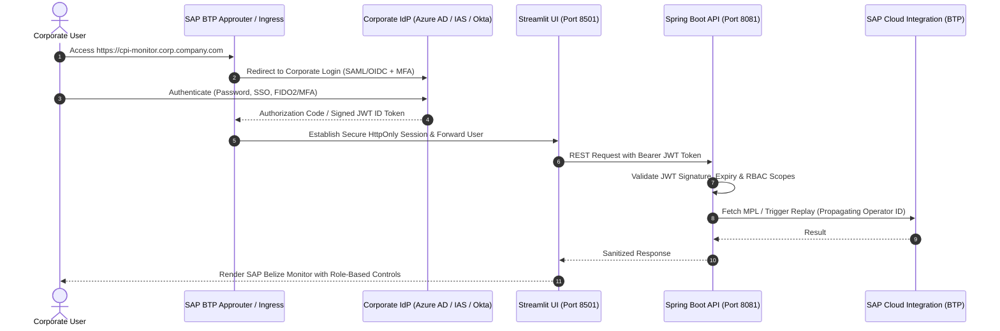
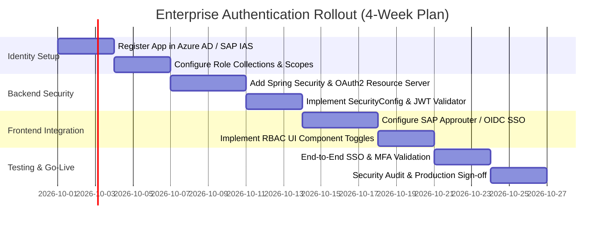

# 🔐 Enterprise User Login & Authentication Implementation Plan

This document defines the production implementation plan for integrating enterprise-grade **Single Sign-On (SSO)**, **Corporate Identity Federation**, **Role-Based Access Control (RBAC)**, and **Principal Propagation** when deploying the SAP CI Message Monitor in a company.

---

## 📑 Table of Contents

1. [Architectural Overview](#1-architectural-overview)
2. [Identity Provider (IdP) Federation Options](#2-identity-provider-idp-federation-options)
3. [End-to-End Enterprise Authentication Flow](#3-end-to-end-enterprise-authentication-flow)
4. [Role-Based Access Control (RBAC) Matrix](#4-role-based-access-control-rbac-matrix)
5. [Backend Implementation (Spring Security & OAuth2 Resource Server)](#5-backend-implementation-spring-security--oauth2-resource-server)
6. [Frontend Authentication Options (SAP Approuter vs OIDC Client)](#6-frontend-authentication-options-sap-approuter-vs-oidc-client)
7. [Principal Propagation & Audit Trail in SAP CPI](#7-principal-propagation--audit-trail-in-sap-cpi)
8. [Multi-Factor Authentication (MFA) & Conditional Access](#8-multi-factor-authentication-mfa--conditional-access)
9. [Step-by-Step Implementation Roadmap](#9-step-by-step-implementation-roadmap)

---

## 1. Architectural Overview

In an enterprise corporate deployment:
- **No Local Password Handling:** The application must never collect or store user passwords in form fields.
- **Enterprise SSO:** Authentication is delegated to the company's central Identity Provider via standard **OpenID Connect (OIDC)** or **SAML 2.0**.
- **Stateless JWT Tokens:** User identity and authorization roles are exchanged via cryptographically signed **JSON Web Tokens (JWT)**.
- **Principal Propagation:** The operator's corporate identity is forwarded to SAP Cloud Integration so CPI audit logs record the exact individual who viewed payloads or triggered replays.



---

## 2. Identity Provider (IdP) Federation Options

The system supports standard corporate identity ecosystems:

| IdP Solution | Protocol | Best Suited For |
| :--- | :--- | :--- |
| **SAP Cloud Identity Services (IAS)** | OpenID Connect / SAML 2.0 | Native SAP BTP landscapes; centralizes SAP cloud user management. |
| **Microsoft Entra ID (Azure AD)** | OpenID Connect (OAuth2 PKCE) | Organizations standardized on Microsoft 365 / Azure. |
| **Okta / PingFederate** | OpenID Connect / SAML 2.0 | Enterprise multi-cloud environments. |
| **Active Directory Federation Services (ADFS)** | SAML 2.0 | On-premises corporate Active Directory environments. |

---

## 3. End-to-End Enterprise Authentication Flow

1. **User Initiation:** Operator navigates to the corporate monitoring URL.
2. **Challenge & Redirection:** The edge proxy (Approuter) detects an unauthenticated session and redirects the browser to the corporate IdP.
3. **MFA & Corporate Verification:** User authenticates via corporate SSO (Windows Hello, Azure MFA, or Okta Verify).
4. **Token Generation:** The IdP issues a signed JWT containing:
   - User identity (`preferred_username`, `email`, `sub`).
   - Group memberships (`groups`, `roles`).
   - Corporate tenant ID.
5. **Secure Token Injection:** The token is forwarded to the application layer via encrypted HTTP headers.
6. **Stateless API Verification:** Spring Boot verifies the JWT using the IdP's public keys (JWKS endpoint) and enforces RBAC guards on every REST call.

---

## 4. Role-Based Access Control (RBAC) Matrix

Users are assigned permissions based on corporate Active Directory groups:

| Role Name | AD / IAS Group | View Overview & Status | Inspect Root Cause Errors | View Attachment Payload | Execute Message Replay |
| :--- | :--- | :---: | :---: | :---: | :---: |
| **Monitor Viewer** | `CPI_MONITOR_VIEWER` | ✅ | ✅ | ❌ | ❌ |
| **Payload Auditor** | `CPI_MONITOR_AUDITOR` | ✅ | ✅ | ✅ | ❌ |
| **Integration Operator**| `CPI_MONITOR_OPERATOR` | ✅ | ✅ | ✅ | ✅ |
| **Integration Admin** | `CPI_MONITOR_ADMIN` | ✅ | ✅ | ✅ | ✅ (Config & All Flows) |

### UI Behavior by Role:
- **Viewers:** The `👁️ View Payload` button and `⚡ Execute Resend` panel are completely hidden.
- **Auditors:** Can view payloads, but the resend button displays a disabled badge: *"Replay requires Operator Role"*.
- **Operators:** Full access to view payloads and execute replays.

---

## 5. Backend Implementation (Spring Security & OAuth2 Resource Server)

### Step 5.1: Add Dependencies to `backend/pom.xml`

```xml
<dependency>
    <groupId>org.springframework.boot</groupId>
    <artifactId>spring-boot-starter-security</artifactId>
</dependency>
<dependency>
    <groupId>org.springframework.boot</groupId>
    <artifactId>spring-boot-starter-oauth2-resource-server</artifactId>
</dependency>
```

### Step 5.2: Configure `application.yml` for Corporate IdP

```yaml
spring:
  security:
    oauth2:
      resourceserver:
        jwt:
          # Enterprise JWKS Issuer URL (e.g., Azure AD or SAP IAS)
          issuer-uri: https://login.microsoftonline.com/<TENANT_ID>/v2.0
          # Or SAP IAS: https://<tenant>.accounts.ondemand.com
          jwk-set-uri: https://login.microsoftonline.com/<TENANT_ID>/discovery/v2.0/keys
```

### Step 5.3: Security Configuration Class (`SecurityConfig.java`)

```java
package com.example.sapcimonitor.config;

import org.springframework.context.annotation.Bean;
import org.springframework.context.annotation.Configuration;
import org.springframework.security.config.annotation.method.configuration.EnableMethodSecurity;
import org.springframework.security.config.annotation.web.builders.HttpSecurity;
import org.springframework.security.config.http.SessionCreationPolicy;
import org.springframework.security.web.SecurityFilterChain;

@Configuration
@EnableMethodSecurity(prePostEnabled = true)
public class SecurityConfig {

    @Bean
    public SecurityFilterChain filterChain(HttpSecurity http) throws Exception {
        http
            .cors(cors -> cors.configure(http))
            .csrf(csrf -> csrf.disable()) // Stateless REST API
            .sessionManagement(sm -> sm.sessionCreationPolicy(SessionCreationPolicy.STATELESS))
            .authorizeHttpRequests(auth -> auth
                .requestMatchers("/actuator/health").permitAll()
                .requestMatchers("/api/messages/*/resend").hasAnyAuthority("SCOPE_CPI_MONITOR_OPERATOR", "ROLE_OPERATOR")
                .requestMatchers("/api/messages/*/attachments/*").hasAnyAuthority("SCOPE_CPI_MONITOR_AUDITOR", "SCOPE_CPI_MONITOR_OPERATOR", "ROLE_OPERATOR")
                .requestMatchers("/api/messages/**").authenticated()
                .anyRequest().denyAll()
            )
            .oauth2ResourceServer(oauth2 -> oauth2.jwt());

        return http.build();
    }
}
```

---

## 6. Frontend Authentication Options

### Architecture Recommendation: SAP BTP Approuter (Standard Enterprise Pattern)

In SAP BTP, the frontend and backend are fronted by **`@sap/approuter`**, which handles OAuth2 authorization code flows and manages session cookies:

#### `xs-app.json` Configuration:
```json
{
  "welcomeFile": "/index.html",
  "authenticationMethod": "route",
  "routes": [
    {
      "source": "^/api/(.*)$",
      "target": "/api/$1",
      "destination": "backend-api",
      "authenticationType": "xsuaa",
      "csrfProtection": true
    },
    {
      "source": "^/(.*)$",
      "target": "/$1",
      "destination": "frontend-ui",
      "authenticationType": "xsuaa"
    }
  ]
}
```

---

## 7. Principal Propagation & Audit Trail in SAP CPI

When an operator triggers a message replay, the backend injects non-repudiation audit headers into the outbound HTTP request to SAP Cloud Integration:

```java
// Propagate logged-in corporate user context
Authentication auth = SecurityContextHolder.getContext().getAuthentication();
String currentOperatorEmail = auth.getName(); // e.g., 'jane.doe@company.com'

HttpHeaders outHeaders = new HttpHeaders();
outHeaders.set("X-Resent-By-User", currentOperatorEmail);
outHeaders.set("SAP_ResentByOperator", currentOperatorEmail);
outHeaders.set("SAP_ResendTimestampUTC", Instant.now().toString());
```

In the target Integration Flow, these headers are accessible via `${in.header.SAP_ResentByOperator}` and written to the CPI Message Processing Log (MPL) custom status, providing complete traceability.

---

## 8. Multi-Factor Authentication (MFA) & Conditional Access

Because authentication is federated to your corporate IdP:
- **No Custom MFA Code Required:** The application automatically benefits from enterprise MFA policies.
- **Conditional Access:** IT security can enforce:
  - Access restricted to corporate-managed devices (Intune / CrowdStrike compliant).
  - Access blocked from untrusted IP ranges or foreign countries.
  - Periodic session expiration and re-authentication (e.g. 8-hour shift limits).

---

## 9. Step-by-Step Implementation Roadmap



### Quick Verification Checklist:
1. [ ] App registered in Corporate IdP (Azure AD / SAP IAS) with redirect URI configured.
2. [ ] Security groups created in Active Directory (`CPI_MONITOR_VIEWER`, `CPI_MONITOR_OPERATOR`).
3. [ ] Spring Boot backend configured with corporate JWKS URI.
4. [ ] Ingress proxy / Approuter deployed with HTTPS and secure session cookies.
5. [ ] Verified that Viewers cannot resend messages or view payload attachments.
6. [ ] Verified that Operators can view payloads and re-queue failed messages with identity headers.
