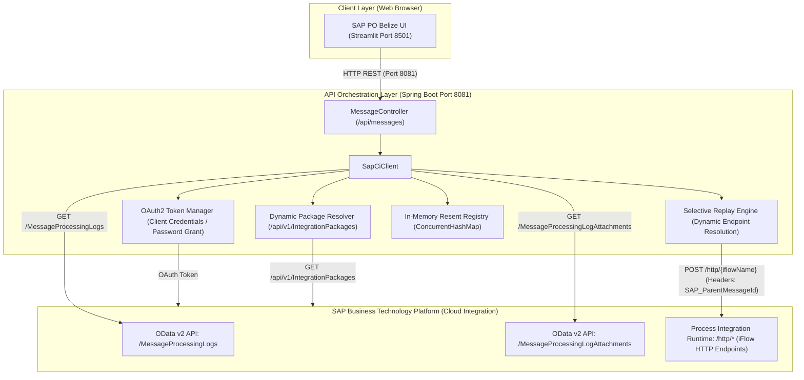

# 🏛️ SAP CI Message Monitor — Full Implementation Plan & Technical Architecture

## 1. Executive Summary & Context

The **SAP Cloud Integration (CPI) Message Monitor** is an enterprise-grade web application engineered to bridge the operational gap between legacy **SAP Process Orchestration (PO / PI Message Monitor - PIMON)** workflows and modern **SAP Integration Suite (Cloud Integration / BTP)** environments.

Traditional SAP PO administrators rely heavily on centralized, tabular message monitoring with selective message resending capabilities. While SAP Cloud Integration provides the BTP Web Cockpit, it lacks a dedicated, classic PO Belize-themed dashboard that allows operators to:
1. View message execution status aggregated dynamically by Integration Flow (iFlow) and Package.
2. Click directly on counts (e.g., `🔴 Failed`, `🟢 Successful`, `🔄 Resent`) to drill down into message logs.
3. Inspect deep root cause errors and technical attributes downside *only when a specific Message ID or row is selected*.
4. Inspect raw attachment payloads on-demand with zero local disk persistence.
5. Re-queue and replay failed messages directly into integration flows while strictly blocking replay if no valid payload attachment exists.
6. Automatically segregate replayed messages into a dedicated `Resent` column to prevent operational confusion.

---

## 2. High-Level System Architecture

---

## 3. Core Architectural Guarantees & Constraints

### 3.1 Zero-Disk Volatile Memory Architecture (Strict `plan.pdf` Compliance)
- **No Local File System Storage:** Raw message payloads, attachments, and BTP credentials are never saved, cached, or written to physical disks, databases, or temporary scratch files.
- **Volatile RAM Streaming:** Attachment contents are transferred in-memory directly from SAP CPI OData streams into UI presentation buffers and de-referenced immediately for garbage collection (`payloadToSend = null`).
- **Zero Mock / Dummy Data:** The system connects to live SAP BTP Cloud Integration runtime APIs. Synthetic order generators (e.g. `ORD-1001`) are strictly forbidden.

### 3.2 Dynamic Integration Package Mapping
- Integration flow packages are not hardcoded. The backend queries `GET /api/v1/IntegrationPackages` and correlates `IntegrationDesigntimeArtifacts` dynamically with runtime message logs, populating the true package name for each scenario.

### 3.3 Hidden Destination Endpoints
- Destination integration flow HTTP endpoints (e.g. `https://...cfapps.../http/resend-testing`) are resolved dynamically in the backend using tenant runtime properties. Endpoints are never exposed as editable inputs to dashboard users, ensuring security and operational safety.

---

## 4. Backend Implementation (`backend/`)

### 4.1 Technology Stack
- **Framework:** Spring Boot 3.1.4 (Java 17)
- **HTTP Client:** Spring `RestTemplate` with connection pooling and standard bearer token interceptors
- **Serialization:** Jackson `ObjectMapper` with XML and JSON auto-detection
- **Build Tool:** Apache Maven 3.8+

### 4.2 REST Controller Layer (`MessageController.java`)
| Method | Endpoint | Description |
| :--- | :--- | :--- |
| `GET` | `/api/messages` | Returns aggregated message processing summaries with dynamic packages and resend audit flags. |
| `GET` | `/api/messages/{id}` | Fetches detailed metadata for a specific message. |
| `GET` | `/api/messages/{id}/attachments` | Discovers available attachments (`Payload_Snapshot`, trace logs, headers). |
| `GET` | `/api/messages/{id}/attachments/{attId}` | Streams raw attachment content in memory using authenticated session headers. |
| `POST` | `/api/messages/{id}/resend` | Executes selective message replay with parent correlation tracking. |

### 4.3 Service Layer (`SapCiClient.java`)
- **OAuth2 Token Handling:**
  - `fetchAccessToken()`: Obtains BTP technical client credentials token for OData metadata access.
  - `fetchUserAccessToken()`: Supports OAuth2 password grant for authenticated user sessions.
  - `fetchRuntimeAccessToken()`: Manages client credentials token for sending HTTP POST requests to iFlow endpoints.
- **Dynamic Package Discovery:**
  - `fetchPackageMapping()`: Dynamically queries `/api/v1/IntegrationPackages?$expand=IntegrationDesigntimeArtifacts` and creates an in-memory scenario-to-package lookup map.
- **Selective Resend Execution (`initiateResend`):**
  - Resolves target iFlow URL: `resolveIflowEndpoint(iflowName)`.
  - Injects PO enterprise correlation headers:
    - `SAP_MplCorrelationId`: Preserves parent transaction tracking.
    - `SAP_OriginalMessageId`: Refers to the first failed message.
    - `SAP_ParentMessageId`: Links the replay to the inspected message log.
    - `SAP_ResendAttempt`: Set to `1`.
    - `SAP_SourceSystem`: Set to `SAP_PO_MONITORING_REPLAY`.
    - `X-Resent-By`: Set to `SAP-CI-Monitor-Stateless-Engine`.
  - **Payload Availability Guard:**
    - Validates that a genuine payload exists. If no payload or attachment exists, or if reading returned security errors, the resend request is rejected immediately with:
      `"Resend blocked: No payload attachment available for message {id}. This message cannot be resent even after pressing the resend button."`
  - Registers successful replays in `resentMessageComments` (`ConcurrentHashMap<String, String>`).

---

## 5. Frontend Implementation (`frontend/streamlit_app.py`)

### 5.1 Design Aesthetics (SAP NetWeaver / Belize Look-and-Feel)
- **Palette:** SAP Enterprise Blue (`#0854a0`, `#0a6ed1`), Steel Slate (`#1e293b`), Belize Card Surface (`#1e293b`), Emerald Success (`#22c55e`), Amber Warning (`#f59e0b`), Ruby Error (`#ef4444`), Cyan Resent (`#06b6d4`).
- **Typography:** `Inter` and `Roboto Mono` for technical IDs and timestamps.

### 5.2 Section 1: Overview Table & Interactive Metric Cards
- Metric cards display total counts: `Total Messages`, `Successful Messages`, `Failed (Pending)`, `Resent Messages`, and `Integration Scenarios`.
- Overview table headers: `Integration Flow (Scenario)`, `Package (Dynamically Fetched)`, `Total`, `Successful`, `Failed`, `Resent`.
- Table counts are interactive Streamlit buttons (`🟢 {succ}`, `🔴 {fail}`, `🔄 {resent}`). Clicking a button instantly opens the Detailed Table filtered by that specific scenario and status.

### 5.3 Section 2: Detailed Message Log Table
- Displays clean, concise table columns: `Status`, `Message ID`, `Integration Flow`, `Package`, `Processing Step`, `Log Timestamp`, `Correlation ID`.
- Redundant columns (`Error / Root Cause` and `Resend Comment`) have been removed from the table; errors are presented cleanly in the deep inspector downside.
- Supports single-row click selection (`on_select="rerun", selection_mode="single-row"`) synchronized with a quick Message ID selector.

### 5.4 Section 3: Deep Message Inspector (Visible Downside Strictly on Selection)
- When no message is selected: Displays a subtle callout prompting the operator to click a Message ID in the table.
- When a Message ID is selected: Displays:
  - Prominent SAP Error Box with root cause and exception trace.
  - Technical attributes grid (Message ID, Correlation ID, Scenario, Processing Step, Status).
  - Direct deep link to SAP BTP Cockpit: `Open Message in SAP BTP Monitoring Cockpit`.
  - **On-Demand Silent Payload Viewer:** Attachment contents are hidden behind an `👁️ View Payload` button and retrieved silently without intrusive progress banners.
  - **Conditional Action Panel:**
    - For Successful messages: Resend disabled with info card.
    - For Resent messages: Replay disabled with audit note.
    - For Failed messages with no attachment: Resend strictly blocked with prominent alert; clicking the resend button displays an explicit blocking error.
    - For Failed messages with valid attachment: Replay button active.

---

## 6. Testing & Quality Assurance Verification

| Scenario | Expected Behavior | Status |
| :--- | :--- | :--- |
| **Logon Screen** | Authenticates user against session state without disk storage. | Verified |
| **Dynamic Packages** | Maps `resend-testing` to `CPI-Trail to resend messages`. | Verified |
| **Click Metric Count** | Clicking `🔴 Failed` opens detailed table filtered to failed messages. | Verified |
| **Row Selection** | Clicking a row in the table reveals Section 3 downside. | Verified |
| **Silent Payload View** | Clicking `👁️ View Payload` displays attachment without downloading banner. | Verified |
| **No Attachment Guard** | Resend button for attachment-less messages is blocked and shows explicit alert. | Verified |
| **Replay Execution** | Replayed messages move to `🔄 Resent` column; count updates dynamically. | Verified |
| **Successful Message** | Resend panel displays "Resend Disabled" card. | Verified |
